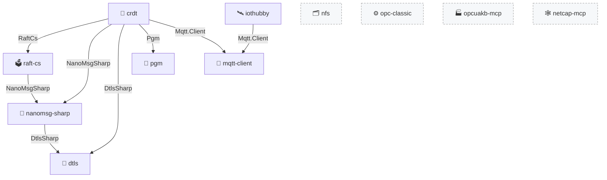

<h1 align="center">📚 Open-source .NET libraries &amp; tools</h1>

A collection of public, NativeAOT-ready building blocks for modern .NET — secure transport, messaging, IoT connectivity, scalability protocols, consensus, replication, and file access — plus a couple of Model Context Protocol (MCP) servers.

  
  
  

---

## 🤖 MCP servers

[Model Context Protocol](https://modelcontextprotocol.io) servers. These ship as container images and/or .NET tools rather than reusable nuget.org libraries.

### 🏭 [opcuakb-mcp](https://github.com/marcschier/opcuakb-mcp)

An **OPC UA Knowledge Base** MCP server that crawls and indexes the OPC UA specification for retrieval-augmented tooling.

* Distributed as a **GHCR** container image: `docker pull ghcr.io/marcschier/opcua-mcp-server`
* Also published as the `OpcUaKb.McpServer` .NET tool to **GitHub Packages**.

### 🕸️ [netcap-mcp](https://github.com/marcschier/netcap-mcp)

An MCP server that captures network traces (pcap/http) and returns them as **pcap, pcapng, JSON, CSV, or text**.

* The MCP server (`Netcap.Mcp`) is published as a .NET tool to **GitHub Packages**, with a container image built from the in-repo `Dockerfile`.

---

## 📦 NuGet libraries

### 📨 [mqtt-client](https://github.com/marcschier/mqtt-client)

High-performance, low-allocation **MQTT 3.1.1 + 5.0** client for .NET. Channels-style API, NativeAOT-ready.

| Package | Version | Downloads |
|---|---|---|
| [`Mqtt.Client`](https://www.nuget.org/packages/Mqtt.Client) |  |  |
| [`Mqtt.Client.Testing`](https://www.nuget.org/packages/Mqtt.Client.Testing) |  |  |

### 🧬 [crdt](https://github.com/marcschier/crdt)

High-performance, NativeAOT-ready **Conflict-free Replicated Data Types (CRDTs)** for modern .NET — the aggregating stack that ties the transports and consensus together.

| Package | Version | Downloads |
|---|---|---|
| [`Crdt`](https://www.nuget.org/packages/Crdt) |  |  |
| [`Crdt.Consensus`](https://www.nuget.org/packages/Crdt.Consensus) |  |  |
| [`Crdt.Consensus.Raft`](https://www.nuget.org/packages/Crdt.Consensus.Raft) |  |  |
| [`Crdt.Gc`](https://www.nuget.org/packages/Crdt.Gc) |  |  |
| [`Crdt.Transport`](https://www.nuget.org/packages/Crdt.Transport) |  |  |
| [`Crdt.Transport.Dtls`](https://www.nuget.org/packages/Crdt.Transport.Dtls) |  |  |
| [`Crdt.Transport.Mqtt`](https://www.nuget.org/packages/Crdt.Transport.Mqtt) |  |  |
| [`Crdt.Transport.NanoMsg`](https://www.nuget.org/packages/Crdt.Transport.NanoMsg) |  |  |
| [`Crdt.Transport.Pgm`](https://www.nuget.org/packages/Crdt.Transport.Pgm) |  |  |

### 🔌 [nanomsg-sharp](https://github.com/marcschier/nanomsg-sharp)

A pure, modern .NET implementation of the **nanomsg and NNG Scalability Protocols (SP)** — wire-compatible with both, with a zero-copy `System.IO.Pipelines` data path.

| Package | Version | Downloads |
|---|---|---|
| [`NanoMsgSharp`](https://www.nuget.org/packages/NanoMsgSharp) |  |  |
| [`NanoMsgSharp.Dtls`](https://www.nuget.org/packages/NanoMsgSharp.Dtls) |  |  |

### 🗳️ [raft-cs](https://github.com/marcschier/raft-cs)

Pure-managed, NativeAOT-ready **Raft consensus** for .NET (modeled on `tikv/raft-rs`) with replaceable storage and transport.

| Package | Version | Downloads |
|---|---|---|
| [`RaftCs`](https://www.nuget.org/packages/RaftCs) |  |  |
| [`RaftCs.Transport`](https://www.nuget.org/packages/RaftCs.Transport) |  |  |
| [`RaftCs.Transport.NanoMsg`](https://www.nuget.org/packages/RaftCs.Transport.NanoMsg) |  |  |
| [`RaftCs.Storage.File`](https://www.nuget.org/packages/RaftCs.Storage.File) |  |  |

### 🗂️ [nfs](https://github.com/marcschier/nfs)

A modern, NativeAOT-ready **.NET 10 NFS client &amp; server** library (ONC/RPC + XDR) supporting NFS v2 / v3 / v4.0 / 4.1 / 4.2 — built for protocol compliance and interop.

| Package | Version | Downloads |
|---|---|---|
| [`Nfs`](https://www.nuget.org/packages/Nfs) |  |  |

> ℹ️ `Nfs` is a consolidated umbrella package; the granular `Nfs.*` assemblies are published to GitHub Packages.

### 📡 [pgm](https://github.com/marcschier/pgm)

Pure-managed, NativeAOT-ready **PGM (RFC 3208)** reliable multicast over UDP for modern .NET.

| Package | Version | Downloads |
|---|---|---|
| [`Pgm`](https://www.nuget.org/packages/Pgm) |  |  |

### 🔐 [dtls](https://github.com/marcschier/dtls)

Cross-platform **DTLS 1.0 / 1.2 / 1.3** for .NET using the host OS cryptography — a managed, AOT-friendly 1.3 engine plus native OpenSSL / Schannel / Apple backends.

| Package | Version | Downloads |
|---|---|---|
| [`DtlsSharp`](https://www.nuget.org/packages/DtlsSharp) |  |  |

### 🛰️ [iothubby](https://github.com/marcschier/iothubby)

High-performance, NativeAOT-ready **Azure IoT Hub &amp; IoT Edge** device/module SDK over MQTT (built on `Mqtt.Client`) — telemetry, cloud-to-device, direct methods, device/module twins, edge module routing, and DPS provisioning.

| Package | Version | Downloads |
|---|---|---|
| [`IoTHubby`](https://www.nuget.org/packages/IoTHubby) |  |  |
| [`IoTHubby.Edge`](https://www.nuget.org/packages/IoTHubby.Edge) |  |  |

### ⚙️ [opc-classic](https://github.com/marcschier/opc-classic)

A cross-platform, NativeAOT-ready **.NET 10 OPC Classic** stack — DA, AE, HDA, Batch, Commands, Complex Data, DX, Security, Discovery, and XML-DA — over a fully managed DCOM/MSRPC transport with self-contained NTLMv2 / Kerberos / SPNEGO authentication. No Windows COM required at runtime.

| Package | Version | Downloads |
|---|---|---|
| [`Opc.Classic`](https://www.nuget.org/packages/Opc.Classic) |  |  |
| [`Opc.Classic.Windows`](https://www.nuget.org/packages/Opc.Classic.Windows) |  |  |

> ℹ️ `Opc.Classic` is a self-contained SDK meta-package (client + managed server); `Opc.Classic.Windows` adds Windows DCOM server hosting. The Roslyn analyzers (`Opc.Classic.Generators`, `Opc.Classic.MigrationAnalyzer`) and the `Opc.Classic.Mcp` server tool are also on nuget.org; the granular per-spec `Opc.Classic.*` assemblies ship to GitHub Packages.

---

## 🧭 Repo dependencies

All cross-repository links are via published NuGet packages (no source coupling), each repo produces a core nuget without any dependencies to other nugets produced from other repositories. Extension libraries pull in nugets from other repositories to extend the functionality of the core nuget:

| Project | Extensions depend on | Via package(s) |
|---|---|---|
| 🧬 **crdt** | raft-cs, nanomsg-sharp, dtls, pgm, mqtt-client | `RaftCs`, `RaftCs.Transport`, `NanoMsgSharp`, `DtlsSharp`, `Pgm`, `Mqtt.Client` |
| 🗳️ **raft-cs** | nanomsg-sharp | `NanoMsgSharp` (`RaftCs.Transport.NanoMsg`) |
| 🔌 **nanomsg-sharp** | dtls | `DtlsSharp` (`NanoMsgSharp.Dtls`) |
| 🛰️ **iothubby** | mqtt-client | `Mqtt.Client` |
| 📨 **mqtt-client** · 📡 **pgm** · 🔐 **dtls** · 🗂️ **nfs** · ⚙️ **opc-classic** | — | standalone |
| 🏭 **opcuakb-mcp** · 🕸️ **netcap-mcp** | — | standalone |

The libraries are layered: lower-level transports and consensus are independent packages that the higher-level **CRDT** stack composes. An arrow **A → B** means *A depends on B* (consumes B's NuGet package).

> Dashed nodes (`nfs`, `opc-classic`, `opcuakb-mcp`, `netcap-mcp`) are standalone — they have no dependencies on the other projects here.
